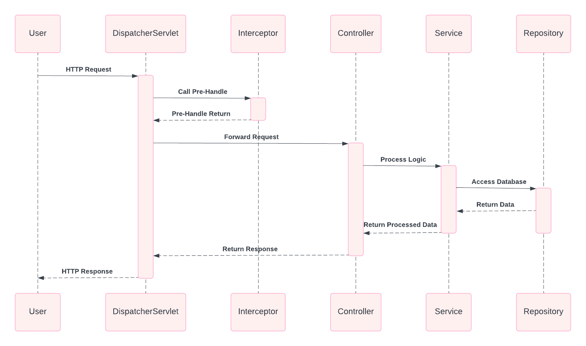
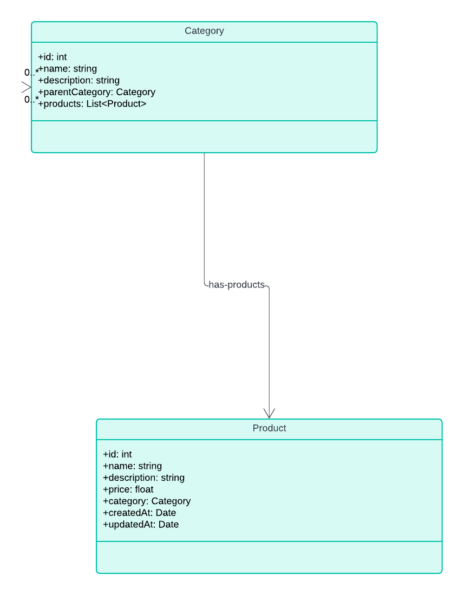
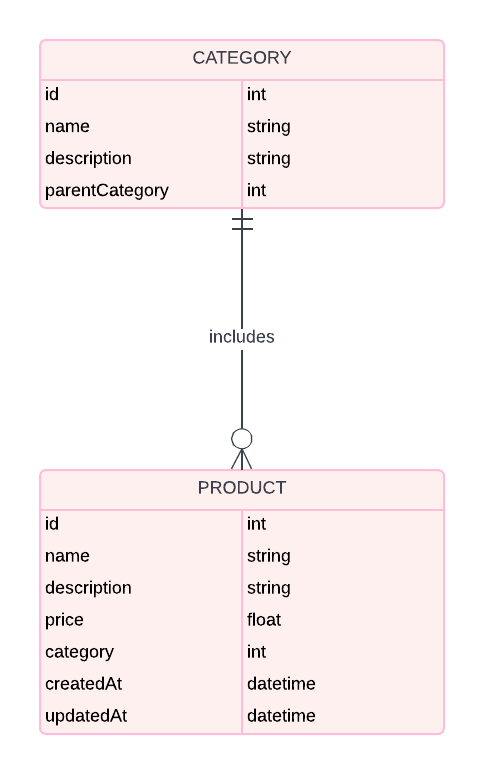

# Product Management System

## Project Overview

The Product Management System is a comprehensive e-commerce platform developed using Spring Boot, offering advanced product management features. It handles requests efficiently, supports data binding, and integrates seamlessly with both relational and NoSQL databases. The system also employs a binary tree structure for optimal product categorization and retrieval.

## Table of Contents

- [Project Overview](#project-overview)
- [Objectives](#objectives)
- [Technologies Used](#technologies-used)
- [Setup Instructions](#setup-instructions)
- [API Endpoints](#api-endpoints)
- [Entities](#database-entities)
- [Diagrams](#diagrams)
 


## Objectives

- Implement a robust product management system using Spring Boot with advanced features.
- Develop efficient request handling using Dispatcher Servlet, including interceptors and data binding.
- Utilize Spring Data JPA for relational database interactions and Spring Data MongoDB for NoSQL stores.
- Implement a binary tree for efficient product categorization and retrieval.

## Technologies Used

- Java JDK 21 (LTS)
- Spring Boot
- Spring Data JPA
- Spring Data MongoDB
- Spring Boot Actuator
- Maven
- Hibernate for ORM
- MongoDB (for NoSQL storage)

## Setup Instructions

1. **Clone the Repository:**
   ```bash 
https://github.com/virgile-am/productmanagementapp.git
### Build the Project:
mvn clean install
### Run the Application:
mvn spring-boot:run

## Access the Application:

The application will be available at http://localhost:4000

# API Endpoints

## Products

- **GET api/v1/products**: Retrieve all products
- **GET api/v1/products/{id}**: Retrieve a product by ID
- **POST api/v1/products**: Create a new product
- **PUT api/v1/products/{id}**: Update a product by ID
- **DELETE api/v1/products/{id}**: Delete a product by ID

## Categories

- **GET api/v1/categories**: Retrieve all categories
- **GET api/v1/categories/{id}**: Retrieve a category by ID
- **POST api/v1/categories**: Create a new category
- **PUT api/v1/categories/{id}**: Update a category by ID
- **DELETE /api/v1/categories/{id}**: Delete a category by ID
- ### Postman endpoint  Repo link
https://www.postman.com/virgile250/workspace/websort/collection/36765726-0a81cf1f-bbb0-44a0-8db6-a09d4435f5d4?action=share&creator=36765726
## Entities 
### Product
- ID
- Name
- Description
- Price
- Category
- Created At
- Updated At

## Category
- ID
- Name
- Description
- Parent Category
- Products

## Diagrams

## Sequence Diagram


## Entity Relationship Diagram

## Class Diagram

